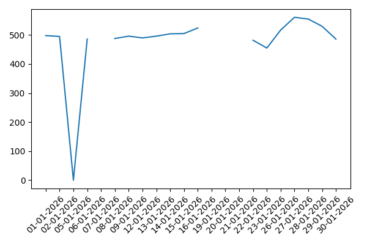
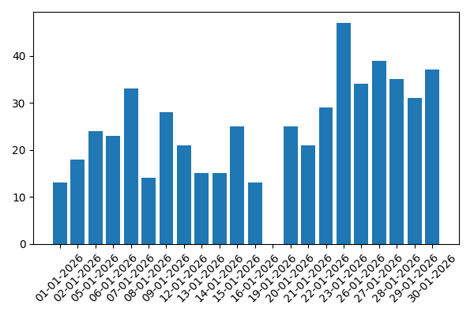

<!-- HEADER -->
<table style="width:100%; border-bottom:4px solid #1f6f3e; padding-bottom:8px;">
<tr>

<!-- LEFT LOGO -->
<td style="width:15%; vertical-align:middle; text-align:left;">

</td>

<!-- CENTER TEXT -->
<td style="width:70%; text-align:center; vertical-align:middle;">

<h2 style="color:#1f6f3e; margin:0; font-size:22px;">
Power Planning & Monitoring Company
</h2>

Ministry of Energy - Government of Pakistan

</td>

<!-- RIGHT LOGO -->
<td style="width:15%; vertical-align:middle; text-align:right;">

</td>

</tr>
</table>

<!-- EMPLOYEE INFO BLOCK (Now Separate from Header) -->
<table style="width:100%; margin-top:12px; border:1px solid #ccc; font-size:14px; border-collapse:collapse;">
<tr style="background:#f2f9f4;">
<td style="padding:8px; border:1px solid #ccc;">
<strong>Employee:</strong> {{EMPLOYEE_NAME}}
</td>

<td style="padding:8px; border:1px solid #ccc;">
<strong>Month:</strong> {{MONTH_YEAR}}
</td>

<td style="padding:8px; border:1px solid #ccc;">
<strong>Target Time:</strong> 480 Minutes
</td>
</tr>
</table>

<!-- TABLE SECTION -->
<h3 style="background:#1f6f3e; color:white; padding:8px; border-radius:3px; font-size:15px; margin-top:15px;">
Attendance Record
</h3>

<table style="width:100%; border-collapse:collapse; margin-top:8px; font-size:13px;">

<tr style="background:#4caf50; color:white;">
<th style="padding:6px; white-space:nowrap;">Date</th>
<th style="padding:6px; white-space:nowrap;">Time In</th>
<th style="padding:6px; white-space:nowrap;">Time Out</th>
<th style="padding:6px; white-space:nowrap;">Worked</th>
<th style="padding:6px; white-space:nowrap;">Late</th>
<th style="padding:6px; white-space:nowrap;">Less 8h</th>
<th style="padding:6px; white-space:nowrap;">Status</th>
<th style="padding:6px; white-space:nowrap;">Comments</th>
</tr>

{{TABLE_ROWS}}

</table>

<!-- CHART SECTION -->
<h3 style="background:#1f6f3e; color:white; padding:8px; border-radius:3px; font-size:15px; margin-top:20px;">
Graphical Analysis
</h3>

<table style="width:100%; margin-top:10px;">
<tr>

<td style="width:50%; text-align:center;">

<strong>Worked Minutes per Day</strong>

</td>

<td style="width:50%; text-align:center;">

<strong>Late Minutes per Day</strong>

</td>

</tr>
</table>

<!-- SUMMARY SECTION -->
<h3 style="background:#1f6f3e; color:white; padding:8px; border-radius:3px; font-size:15px; margin-top:20px;">
Monthly Summary
</h3>

{{SUMMARY_PLACEHOLDER}}

 

Automatically Generated Report | Confidential Document

